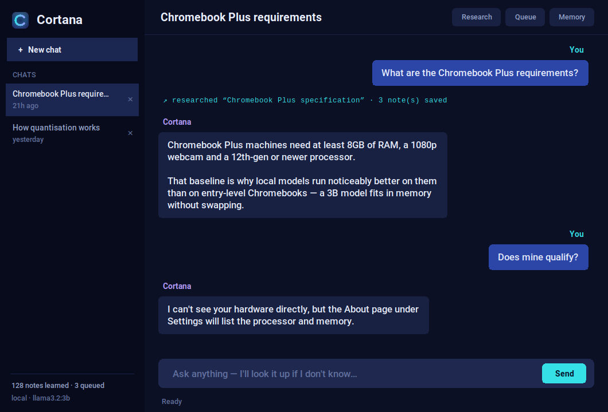

# Cortana

A local, self-improving AI assistant for Chromebooks. It runs a small
quantized model on-device via [Ollama](https://ollama.com), opens as a real
app from the ChromeOS launcher, and grows a local knowledge base over time by
researching the web — including on its own, unprompted.



## Install

```bash
git clone <this repo> cortana
cd cortana
./install.sh
```

One command. It installs the system packages, builds the Python environment,
installs Ollama and downloads a model sized to your Chromebook's RAM, adds
Cortana to the ChromeOS launcher, and starts the background research daemon.

Then open **Cortana** from the launcher — no terminal needed.

## How "self-improve" works here

Chromebooks don't have a usable GPU and Crostini doesn't expose compute
acceleration to the Linux VM, so this project does **not** retrain the
model's weights on-device (that would be far too slow to be usable). Instead
it improves in a different, fully local way — it accumulates knowledge:

1. It researches a topic: searches the web, fetches a handful of pages, and
   asks the local model to distill each one into a concise note.
2. Notes are embedded and stored in a local SQLite database (`data/memory.db`).
3. On every future chat turn, it retrieves the most relevant notes from that
   database and feeds them to the model as context (retrieval-augmented
   generation, aka RAG).

The model's weights never change, but its effective knowledge grows, and it
remembers across sessions and reboots.

There are three ways research gets triggered, and only the first needs you:

| Trigger | Needs you? | What happens |
|---|---|---|
| **Research…** in the app | Yes | Researches that topic immediately. |
| Mid-chat | No | If Cortana doesn't know something while answering, she searches the web herself, saves notes, then answers — and tells you what she looked up. |
| Background daemon | No | Runs on a timer with no conversation at all. Researches a topic, asks the model what's worth exploring next, queues those, repeats. Refills its own queue when it runs dry. |

If you later want actual weight fine-tuning, the notes in `data/memory.db`
are a ready-made dataset to ship to a cloud GPU for a LoRA run. That's out of
scope here.

## Requirements

- A Chromebook with Linux (Crostini) enabled:
  Settings → Advanced → Developers → Linux development environment.
- ~4GB free disk space for the model (more if you let the daemon run for
  months — see *Disk and speed* below).
- Works on both Intel/AMD and ARM Chromebooks.

### What the installer handles

These are the things that actually bite on a fresh Crostini container:

- Installs `python3-venv` and `python3-tk` — Debian ships `python3` **without**
  the venv module (so `python3 -m venv` fails) and without the Tk bindings
  (so the app has no window to draw into).
- Detects RAM and picks a model that fits (see below).
- Installs Ollama and starts the server, since Crostini doesn't reliably run
  it as a systemd service.
- Installs the launcher entry and the background research service.

The Python environment is built *before* anything that needs the Ollama
server, so a failed model download still leaves you with a working install.

Options: `./install.sh --no-service` (no background research) or
`./install.sh --no-launcher` (no launcher entry).

### Model sizing

Chromebook RAM varies a lot, and an oversized model swap-thrashes the VM.
The installer picks automatically:

| Detected RAM | Model | Approx. size |
|---|---|---|
| under 4GB | `llama3.2:1b` | ~1.3GB |
| 4–8GB | `gemma2:2b` | ~1.6GB |
| 8GB+ | `llama3.2:3b` | ~2GB |

Detection reads `MemTotal`, which reports what the Crostini VM actually got —
a few percent under the Chromebook's nominal RAM — and rounds down. So a
nominal 8GB Chromebook lands on the 2B model. That bias is deliberate:
a smaller model that responds promptly beats a bigger one that thrashes.

Override any time with `export CHAT_MODEL=llama3.2:3b`.

## Usage

Open **Cortana** from the ChromeOS launcher. In the app:

- Type in the box to chat. Relevant saved notes are pulled in automatically,
  and Cortana researches the web on her own mid-answer when she doesn't know
  something — you'll see a `↗ researched "…"` line when she does.
- **Research…** — look something up right now.
- **Queue…** — hand a topic to the background daemon for later.
- **Memory** — how many notes are stored and where the database lives.

Model work runs on a background thread, so the window stays responsive even
when a model is slow.

### Multiple chats

The sidebar keeps separate conversations, like any chat app:

- **+ New chat** starts a fresh thread. Each one is named automatically after
  its first message.
- Click any chat in the sidebar to switch back to it. Conversations are
  stored on disk, so they survive closing the app and rebooting.
- Each chat keeps its own context — a follow-up like "tell me more about
  that" resolves against that conversation only, and nothing leaks between
  threads.
- **Delete** a chat with the ✕ on its row, or right-click for rename and
  delete. Deleting a conversation removes only that thread; notes Cortana
  learned stay in her memory, since memory is shared across every chat.

That last point is the important distinction: a *conversation* is one thread
of dialogue, while *memory* is everything she has learned. Deleting a chat
never makes her forget a fact.

### Terminal version

The same assistant, if you prefer a REPL:

```bash
./.venv/bin/python -m llm_agent.cli
```

Commands: `/learn <topic>`, `/curious <topic>`, `/queue`, `/memory`,
`/help`, `/exit`.

## Autonomous background research

To have Cortana keep learning with no interaction at all, run the daemon in
another terminal tab:

```bash
source .venv/bin/activate
python -m llm_agent.daemon "topic one" "topic two"   # seed topics optional
```

### Running it automatically (no terminal)

`install.sh` already set this up. If you skipped it:

```bash
./install-service.sh
```

It starts with the Linux container from then on. Useful commands:

```bash
systemctl status cortana-daemon      # is it running?
journalctl -u cortana-daemon -f      # watch what it's learning
sudo systemctl disable --now cortana-daemon   # turn it off
```

**What "automatic" can and can't mean here:** the Crostini container only
runs while ChromeOS's Linux is running — ChromeOS starts it when you open a
Linux app and stops it when Linux shuts down or the Chromebook powers off.
So this starts with no command from you, but it can't research while the
Chromebook is off. Nothing installed *inside* the container can change that.

The installer also creates an `ollama.service` if one doesn't exist, since
the daemon needs a model server. It uses `Wants=` rather than `Requires=`,
so a slow or missing Ollama delays research but never prevents the daemon
from starting. Where Ollama's own packaged service exists, the installer
starts *that* before downloading models — it runs as the `ollama` user and
keeps models in a different place, so pulling into a hand-started server
would look fine until the next reboot, then fail with "model not found".

### If clicking the icon does nothing

It shouldn't any more — the launcher reports failures in a dialog and writes
`launcher.log` — but that file is the first place to look. The most common
cause is that `./install.sh` hasn't been run in this container yet.

Each cycle it pops a pending topic, researches it, saves notes, asks the
model which related topics are worth exploring next, and queues those.

**It won't stall.** If a research pass turns up only things it already knows,
it produces no follow-ups — and since completed topics are never re-queued,
the queue could otherwise drain permanently. When that happens the daemon
asks the model to propose entirely new directions based on what's already in
memory, so it keeps going indefinitely. On a cold start with an empty queue
it seeds itself from `SEED_TOPICS`.

**Being offline doesn't cost it anything.** A topic is only marked researched
if the web was actually reachable. If the daemon starts before the network is
up — the normal case when it runs at boot — topics go back on the queue and
are retried, up to `CURIOSITY_MAX_ATTEMPTS` times, rather than being consumed
and lost forever.

It's bounded on purpose, since nothing supervises it turn by turn:

- `CURIOSITY_INTERVAL_SECONDS` (default 1800 = 30 min) paces research.
- `CURIOSITY_MAX_QUEUE_SIZE` (default 50) caps pending topics.
- `CURIOSITY_FOLLOW_UPS_PER_TOPIC` (default 2) caps topics spawned per pass.
- `CURIOSITY_MAX_ATTEMPTS` (default 5) stops a failing topic retrying forever.
- Self-replenishment fires at most once per drain, not once per poll.

Every action is logged with a timestamp so you can see exactly what it did
while you weren't watching. Stop it any time with Ctrl+C.

The CLI and daemon can run simultaneously — the database uses WAL mode so
`/curious` works while the daemon is mid-write.

### Disk and speed as memory grows

Embeddings are stored as raw float32 blobs and searched with a single
vectorised matrix multiply. Measured against the obvious JSON-text approach
at 768 dimensions, that is **~50-60x faster to scan and ~4x smaller on disk**:

| Notes | JSON scan | Blob scan | JSON size | Blob size |
|---|---|---|---|---|
| 1,000 | 255 ms | 5 ms | 17 MB | 5 MB |
| 5,000 | 1,257 ms | 20 ms | 86 MB | 23 MB |
| 20,000 | 5,029 ms | 83 ms | 344 MB | 94 MB |

This matters because the daemon accumulates indefinitely: a month of
unattended research reaches several thousand notes, and the scan runs on
*every* chat turn before the model starts generating. (Figures are from an
x86 machine; a Chromebook, especially ARM, is several times slower.)

A database written by an older version is converted automatically the first
time it's opened — a one-time pause of a few seconds for a large one — and
vacuumed so the space is actually reclaimed.

Each note costs ~4KB. Running the daemon non-stop at defaults is roughly
**0.8MB/day (~290MB/year)** worst case. To slow that down, raise
`CURIOSITY_INTERVAL_SECONDS` or lower `SEARCH_RESULTS`. Exact-duplicate
notes are discarded, so restating a known fact doesn't accumulate.

## Configuration

All settings are environment variables (see `llm_agent/config.py`):

| Variable | Default | Meaning |
|---|---|---|
| `ASSISTANT_NAME` | `Cortana` | What the assistant calls itself |
| `OLLAMA_HOST` | `http://localhost:11434` | Where Ollama's API is running |
| `CHAT_MODEL` | auto-detected | Model used for conversation |
| `EMBED_MODEL` | `nomic-embed-text` | Model used to embed notes |
| `MEMORY_DB_PATH` | `data/memory.db` | SQLite database path |
| `MEMORY_TOP_K` | `4` | Notes retrieved per chat turn |
| `SEARCH_RESULTS` | `4` | Web results fetched per research pass |
| `MAX_FETCH_CHARS` | `6000` | Page text fed to the model |
| `CURIOSITY_INTERVAL_SECONDS` | `1800` | Seconds between research cycles |
| `CURIOSITY_IDLE_POLL_SECONDS` | `60` | Poll rate while the queue is empty |
| `CURIOSITY_MAX_QUEUE_SIZE` | `50` | Max pending topics |
| `CURIOSITY_FOLLOW_UPS_PER_TOPIC` | `2` | Max topics spawned per pass |
| `CURIOSITY_MAX_ATTEMPTS` | `5` | Retries before abandoning a failing topic |
| `SEED_TOPICS` | 3 defaults | Semicolon-separated cold-start topics; `""` disables |
| `DB_BUSY_TIMEOUT_SECONDS` | `30` | How long a writer waits for the DB lock |

## Project layout

```
llm_agent/
  config.py       settings (env-var driven)
  llm_client.py   wrapper around Ollama's chat/embeddings API
  memory.py       SQLite-backed vector store (notes, cosine search, dedup)
  conversations.py  persistent chat threads (titles, messages, history)
  web_search.py   DuckDuckGo search + page text extraction, no API key
  agent.py        RAG chat, research, follow-up and new-topic proposals
  topics.py       persistent queue of topics for the daemon
  daemon.py       autonomous loop: research, queue follow-ups, self-replenish
  gui.py          the desktop app (Tk, worker thread, never blocks the UI)
  cli.py          interactive REPL
install.sh        one-command installer -- calls the two below
install-launcher.sh  ChromeOS launcher entry (.desktop + icon)
install-service.sh   background research as a systemd service
launch-cortana.sh    what the launcher icon runs
tools/make_icon.py   renders the app icon (stdlib only, no Pillow)
assets/           icon and screenshot
tests/            111 tests, no network or Ollama required
```

## Testing

```bash
./.venv/bin/pip install pytest && ./.venv/bin/python -m pytest tests/ -q
```

The suite is hermetic — the LLM and all network calls are stubbed, so it runs
without Ollama installed and without an internet connection. The GUI worker
tests skip automatically where Tk isn't available.

## Known limitations

- **Search is scraping, not an API.** It uses DuckDuckGo's no-JavaScript
  HTML endpoint, which needs no API key but may break if their markup
  changes. If that happens it surfaces as topics being retried and then
  abandoned, with `web unreachable` in the log — not a crash.
- **Memory search is a linear scan.** Every embedding is compared on each
  search. The vectorised implementation keeps that well under 100ms into the
  tens of thousands of notes, but it is not an approximate-nearest-neighbour
  index and won't scale to millions.
- **Notes are only as good as the model writing them.** A 1–3B model
  summarizing a page will sometimes be vague or wrong, and a wrong note
  becomes context for future answers. Sources are stored alongside every
  note (`/memory`) so you can check them.
- **Only exact duplicates are deduped.** Two differently-worded notes saying
  the same thing will both be stored.
- **No weight fine-tuning**, by design (see above).
